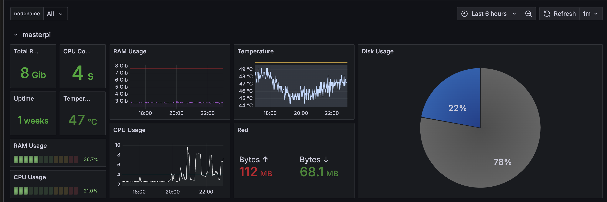

# monitoring.grafana-homelab-dashboard
This dashboard monitors the health and performance of Kubernetes nodes, showcasing essential metrics such as CPU usage, RAM, disk space, and temperature. It allows teams to quickly identify potential issues and optimize resource allocation for improved system efficiency.

